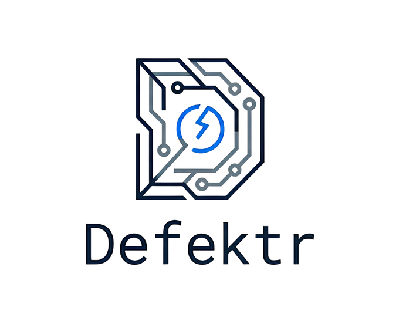

# Defektr — Subnet for Manufacturing Visual Quality Control



Defektr is a Bittensor subnet that produces edge-deployable AI models for manufacturing visual defect detection. Miners compete to build the best defect detection models, validators evaluate them on real benchmark images, and factories purchase the top-performing models.

**Hackathon:** Bittensor Subnet Ideathon — Round 2

---

## How It Works

```
1. Validator publishes a challenge spec on-chain (defect domain, task type, constraints)
2. Miners train defect detection models offline
3. Miners upload model.onnx + metadata.json to IPFS, commit metadata CID on-chain
4. Validator reads commits each epoch, downloads new/updated models to local cache
5. Validator runs each model on block-hash seeded benchmark images
6. Validator scores and calls set_weights() on-chain every epoch
7. Top miner earns TAO — winner-takes-all
8. New challenge block → validator publishes new spec → cycle repeats
```

**Key design:** No Axon/Synapse. Miners upload ONNX files to IPFS. Validator evaluates locally. Zero self-reporting — all metrics are validator-measured.

---

## Scoring System

```
Score = 0.50 × accuracy + 0.30 × speed + 0.20 × robustness
```

**Accuracy** = `0.60 × classification_reward + 0.40 × mask_iou_reward`
- `classification_reward` — normalized BCE on sigmoid confidence output
- `mask_iou_reward` — pixel IoU between predicted mask and ground truth (0.0 if no mask head)

**Speed** — linear decay from T_soft=200ms (full reward) to T_hard=1000ms (zero), measured on validator hardware

**Robustness** — fraction of augmented probe images where hard label is consistent across augmentations

**Edge deployability gate** — hard fail (score=0) if simulated FPS < min_fps (simulated at 15× CPU time to approximate RPi4)

**Copy detection** — if two miners score within 0.2% of each other, the later-registered one is penalized to 0

---

## Miner Architectures (Phase 1)

| Model | Architecture | Outputs | Max score |
|---|---|---|---|
| Baseline | MobileNetV2 classifier | `confidence` only | ~0.80 |
| Improved | MobileNetV2 + U-Net decoder | `confidence` + `mask` | ~0.88 |

The improved model's U-Net decoder unlocks the localisation component of the accuracy reward (α_loc = 0.40), giving it a significant scoring advantage while staying within the edge deployability constraints.

### Benchmark results (50-image validation set)

| Metric | Baseline | Improved |
|--------|----------|----------|
| Total reward | **0.7999** | **0.8766** |
| Accuracy (×0.50) | 0.5496 | 0.5893 |
| — Classification | 0.9160 | 0.8973 |
| — Localisation (IoU) | 0.0000 | 0.1274 |
| Speed (×0.30) | 1.0000 | 1.0000 |
| Latency | 6–8 ms | 26–32 ms |
| Robustness (×0.20) | 1.0000 | 1.0000 |

---

## Prerequisites

- Docker
- Python 3.12
- `uv` package manager
- Pinata account with API key + dedicated gateway (for IPFS model uploads)

### Environment file

Create `.env` in the `defektr/` directory:

```env
PINATA_JWT=your_jwt_token
PINATA_GATEWAY=your-subdomain.mypinata.cloud
```

Get the gateway from: Pinata dashboard → Gateways tab → create a dedicated gateway.

### Python environment

```bash
cd /your_workspace
uv venv .venv --python 3.12
source .venv/bin/activate
uv pip install -r defektr/requirements.txt
```

---

## Running the Full Demo

### Step 1 — Start the local Bittensor chain

```bash

docker run -d --name local_chain -p 9944-9945:9944-9945 ghcr.io/opentensor/subtensor-localnet:devnet-ready
```


### Step 2 — Chain reset (run after every Docker restart)

```bash
cd /home/luka/ws/bittensor_test
source .venv/bin/activate

python scripts/fund_wallets.py      # Alice sudo → 2000 TAO to owner/miner/validator
python scripts/setup_subnet.py      # creates subnet → netuid 2
python scripts/register_neurons.py  # registers validator/default on netuid 2
python scripts/add_stake.py         # stakes 100 TAO to validator/default
```

Or as a one-liner:

```bash
python scripts/fund_wallets.py && python scripts/setup_subnet.py && python scripts/register_neurons.py && python scripts/add_stake.py
```

### Step 3 — Create and register miner/validator hotkeys

```bash
# For the copy-detection demo (3 miners: baseline + improved + copy)
python scripts/setup_hotkeys.py --miners 3

# For a larger demo (up to 10 miners)
python scripts/setup_hotkeys.py --miners 10
```

The metagraph layout after setup:
- uid=0 — subnet owner
- uid=1 — validator/default
- uid=2 — miner/hotkey_0 (baseline)
- uid=3 — miner2/default (improved)
- uid=4 — miner3/default (baseline, copy — for copy-detection demo)
- ...
- uid=N+1 — validator/hotkey_0
- uid=N+2 — validator/hotkey_1

### Step 4 — Upload models to IPFS (requires internet)

```bash
export WALLETS=/home/your_folder/wallets

# Miner 1 — baseline model
python training/upload.py \
    --model training/models/baseline.onnx \
    --spec challenge_spec.json \
    --wallet-name miner --wallet-hotkey hotkey_0 \
    --wallet-path $WALLETS \
    --architecture mobilenet_v2

# Miner 2 — improved model (MobileNetV2 + U-Net)
python training/upload.py \
    --model training/models/improved.onnx \
    --spec challenge_spec.json \
    --wallet-name miner2 --wallet-hotkey default \
    --wallet-path $WALLETS \
    --architecture mobilenet_v2_unet

# Miner 3 — copy of baseline (triggers copy detection)
python training/upload.py \
    --model training/models/baseline.onnx \
    --spec challenge_spec.json \
    --wallet-name miner3 --wallet-hotkey default \
    --wallet-path $WALLETS \
    --architecture mobilenet_v2
```

Each upload: validates model → checks edge deployability → computes SHA-256 → uploads model.onnx to IPFS → uploads metadata.json to IPFS → commits metadata CID on-chain.

### Step 5 — Run the validator

```bash
export WALLETS=/home/your_folder/wallets

python subnet/neurons/validator.py \
    --netuid 2 \
    --subtensor.network ws://127.0.0.1:9944 \
    --wallet.name validator --wallet.hotkey default \
    --wallet.path $WALLETS \
    --defektr.spec challenge_spec.json \
    --defektr.val_dataset data/datasets/bottle \
    --logging.debug
```

Expected validator output every epoch (~3 blocks on localnet):

```
[uid 2] score=0.7999  latency=6.2ms  outputs=1 (bin)
[uid 3] score=0.8766  latency=25.8ms  outputs=2 (seg)
[uid 4] score=0.7999  latency=6.1ms  outputs=1 (bin)
[copy-detection] uid=4 score=0.7999 matches uid=2 score=0.7999 (diff=0.0000) — uid=4 penalized to 0
Scores this epoch: uid=3 0.8766  uid=2 0.7999  uid=0 0.0000  uid=1 0.0000  uid=4 0.0000
set_weights on chain successfully!
```

To run additional validators (for multi-validator Yuma consensus demo):

```bash
# Validator hotkey_0
python subnet/neurons/validator.py --netuid 2 --subtensor.network ws://127.0.0.1:9944 \
    --wallet.name validator --wallet.hotkey hotkey_0 --wallet.path $WALLETS \
    --defektr.spec challenge_spec.json --defektr.val_dataset data/datasets/bottle --logging.debug

# Validator hotkey_1
python subnet/neurons/validator.py --netuid 2 --subtensor.network ws://127.0.0.1:9944 \
    --wallet.name validator --wallet.hotkey hotkey_1 --wallet.path $WALLETS \
    --defektr.spec challenge_spec.json --defektr.val_dataset data/datasets/bottle --logging.debug
```

### Step 6 — Run miners (optional, for incentive logging)

```bash
export WALLETS=/home/your_folder/wallets

python subnet/neurons/miner.py --netuid 2 --subtensor.network ws://127.0.0.1:9944 \
    --wallet.name miner --wallet.hotkey hotkey_0 --wallet.path $WALLETS --logging.debug

python subnet/neurons/miner.py --netuid 2 --subtensor.network ws://127.0.0.1:9944 \
    --wallet.name miner2 --wallet.hotkey default --wallet.path $WALLETS --logging.debug
```

### Utility commands

```bash
# Check all registered UIDs, incentives, and stakes
python scripts/show_metagraph.py 2>/dev/null

# Generate model output comparison image (baseline vs improved)
python scripts/visualize_models.py --out model_comparison.png

# Use a specific image
python scripts/visualize_models.py \
    --image data/datasets/bottle/test/broken_large/000.png \
    --out broken_large.png
```

---
## Protocol Details

### What miners commit on-chain

Only the **metadata CID** goes on-chain via `subtensor.set_commitment()`. The metadata JSON contains:

```json
{
  "challenge_id": "defektr-001",
  "miner_hotkey": "5F...",
  "model": {
    "filename": "model.onnx",
    "cid": "bafyXXX",
    "size_mb": 8.7,
    "sha256": "abc..."
  },
  "inference": {
    "input_name": "image",
    "input_shape": [1, 3, 256, 256],
    "outputs": [{"name": "confidence"}, {"name": "mask"}],
    "normalization": {"mean": [0.485, 0.456, 0.406], "std": [0.229, 0.224, 0.225]},
    "threshold": 0.5
  }
}
```

Validator reads metadata CID → fetches metadata.json → reads `model.cid` → downloads model.onnx.

### Model cache

Validator only re-downloads a model when the committed CID changes. This avoids repeated IPFS downloads when the model hasn't changed between epochs.

### Block-hash seeding

Benchmark images are sampled using the challenge block hash as the seed. This makes sampling deterministic and publicly verifiable, preventing validator-miner collusion.

---

## Anti-Gaming

### Copy detection
If two miners produce scores within 0.2% of each other, the later-registered miner (higher UID) is penalized to 0. Registered-first = treated as original.

### Overfitting prevention
- Large benchmark pool (MVTec AD — 15 industrial defect categories)
- Block-hash seeded sampling — miners cannot predict which images will be used
- Random augmentations at inference time feed the robustness score

### Model size limit
`max_model_size_mb = 100` in challenge spec prevents miners from uploading huge models to stall the validator.

### Edge deployability gate
Models are tested at simulated RPi4 speed (15× CPU time). Models that cannot run at ≥2 FPS on edge hardware score 0.

---

## What Is Still To Do

### For mainnet / production

- [ ] **Root subnet registration** — validator must register on netuid 0 and set weights there for TAO emissions to flow into the subnet. Without this, `metagraph.incentive` stays 0.
- [ ] **Real edge hardware benchmarking** — calibrate `HARDWARE_FACTOR` by measuring actual CPU time ratio between validator machine and RPi4. Currently set to 15× as an approximation.
- [ ] **Multi-dataset benchmark** — extend beyond MVTec AD bottle to all 7 planned datasets (NEU Surface Defect, DAGM, Kolektor SDD, DeepPCB, Severstal, Casting Product).
- [ ] **Challenge rotation** — validator publishes new challenge spec every `CHALLENGE_INTERVAL` blocks with a different defect domain.
- [ ] **Decentralized validator set** — currently running as a single centralized validator (Chutes approach). Phase 2 should open validator registration.
- [ ] **Frontend** — factory dashboard for browsing and purchasing top models.
- [ ] **Mainnet deployment** — register subnet on mainnet, configure proper `EPOCH_TEMPO` and `CHALLENGE_INTERVAL` for production timing.

### Nice to have

- [ ] Cosine-similarity based copy detection (compare raw output vectors, not just final scores)
- [ ] Malicious miner detection via model architecture fingerprinting
- [ ] `publish_challenge.py` wired into validator startup (currently manual)
- [ ] Model versioning — track multiple submissions per miner per challenge
